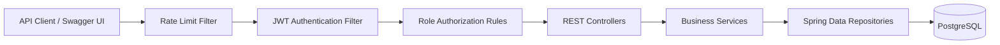
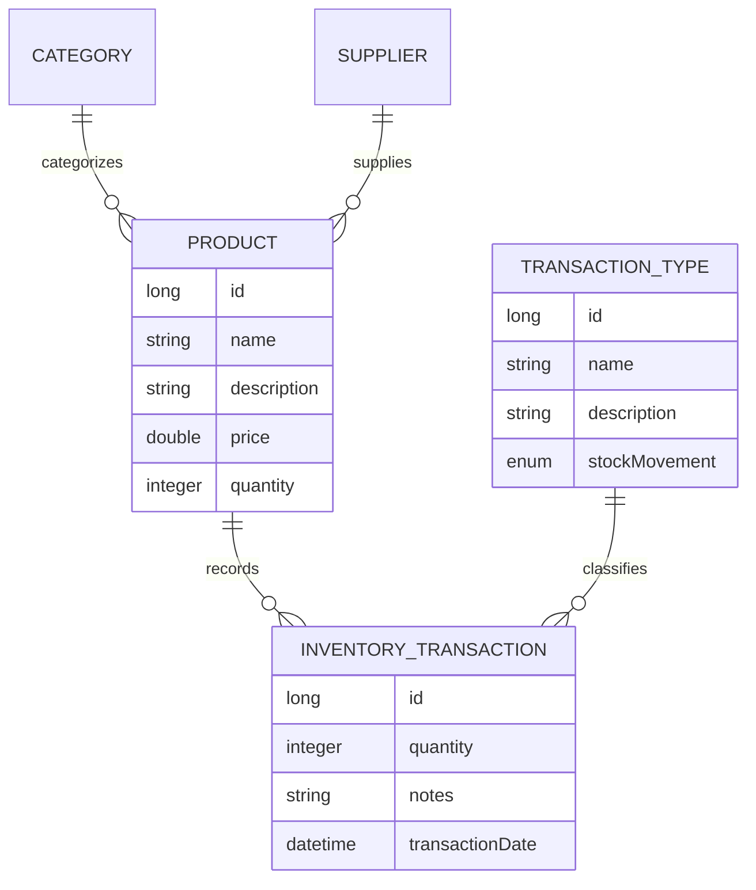

# Inventory API

A secure inventory management REST API built with Spring Boot and PostgreSQL. It models products, categories, suppliers, stock movement types, and an auditable inventory transaction history behind stateless JWT authentication and role-based authorization.

The project demonstrates more than CRUD: inventory transactions apply business rules atomically, outbound stock is rejected when inventory is insufficient, public registration cannot self-assign privileged roles, requests are rate-limited per client IP, and the API is documented through an authenticated Swagger UI.

## Highlights

- Stateless JWT authentication with BCrypt password hashing
- Role-based authorization for `USER`, `MANAGER`, and `ADMIN`
- Transactional stock updates for inbound, outbound, and adjustment movements
- Insufficient-stock protection for outbound transactions
- Filterable resource collections using JPA Specifications
- PostgreSQL persistence with Spring Data JPA
- Per-IP rate limiting with Bucket4j
- Consistent API error responses through global exception handling
- OpenAPI documentation with Bearer token support
- Security-focused regression tests

## Technology

| Area | Technology |
| --- | --- |
| Language | Java 21 |
| Framework | Spring Boot 4.0.6 |
| API | Spring Web MVC |
| Security | Spring Security, JWT, BCrypt |
| Persistence | Spring Data JPA, Hibernate, PostgreSQL |
| Documentation | springdoc-openapi, Swagger UI |
| Rate limiting | Bucket4j |
| Build and test | Maven, JUnit, Mockito, Spring Security Test |

## Architecture



The application is organized by domain (`auth`, `product`, `category`, `supplier`, and `transaction`). Each domain keeps its controllers, DTOs, entities, repositories, services, and exceptions close together.

```text
src/main/java/com/example/inventory_api
├── auth
├── category
├── common/exception
├── product
├── ratelimit
├── security
├── supplier
└── transaction
```

## Domain Model



Transaction types define how a transaction affects stock:

- `IN`: adds the requested quantity.
- `OUT`: subtracts the requested quantity and rejects insufficient stock.
- `ADJUSTMENT`: sets the product quantity to the requested value.

Stock changes and transaction creation run in one database transaction.

## Authorization Model

Public registration always creates a `USER`. This prevents clients from registering themselves as `MANAGER` or `ADMIN`. Privileged roles must be assigned through a trusted administrative process or directly in the database.

| Capability | Public | USER | MANAGER | ADMIN |
| --- | :---: | :---: | :---: | :---: |
| Register and login | Yes | Yes | Yes | Yes |
| Read products, categories, suppliers | No | Yes | Yes | Yes |
| Create, update, or delete products, categories, suppliers | No | No | Yes | Yes |
| Read inventory transactions | No | Yes | Yes | Yes |
| Create inventory transactions | No | No | Yes | Yes |
| Read transaction types | No | Yes | Yes | Yes |
| Create, update, or delete transaction types | No | No | No | Yes |

Protected requests use:

```http
Authorization: Bearer <jwt-token>
```

## Getting Started

### Prerequisites

- Java 21 or newer
- PostgreSQL
- A running PostgreSQL database

The Maven wrapper is included, so a separate Maven installation is not required.

### 1. Configure PostgreSQL and JWT

The application defaults to PostgreSQL at `localhost:5432/postgres`. Override the defaults with environment variables:

```bash
export SPRING_DATASOURCE_URL=jdbc:postgresql://localhost:5432/postgres
export SPRING_DATASOURCE_USERNAME=root
export SPRING_DATASOURCE_PASSWORD=root
export JWT_SECRET="$(openssl rand -base64 32)"
export JWT_EXPIRATION=86400000
```

`JWT_EXPIRATION` is expressed in milliseconds. The example value is 24 hours.

For local development, Hibernate creates and updates the required tables through `spring.jpa.hibernate.ddl-auto=update`.

### 2. Run the Application

```bash
./mvnw spring-boot:run
```

The API starts at `http://localhost:8080`.

### 3. Open the API Documentation

- Swagger UI: [http://localhost:8080/swagger-ui.html](http://localhost:8080/swagger-ui.html)
- OpenAPI JSON: [http://localhost:8080/v1/api-docs](http://localhost:8080/v1/api-docs)

Register or log in, copy the returned token, select **Authorize** in Swagger UI, and enter the token. Login and registration remain public and do not require Bearer authentication.

### 4. Grant a Privileged Role for Local Testing

Public registration intentionally creates only `USER` accounts. After registering, promote a local test account directly in PostgreSQL to exercise protected write operations:

```sql
UPDATE users
SET role = 'ADMIN'
WHERE username = 'portfolio-user';
```

This direct update is for local evaluation only. A production system should provide a separately secured administrative workflow.

## Quick API Walkthrough

### Register a User

```bash
curl -X POST http://localhost:8080/auth/register \
  -H "Content-Type: application/json" \
  -d '{
    "username": "portfolio-user",
    "email": "user@example.com",
    "password": "change-me"
  }'
```

Example response:

```json
{
  "token": "<jwt-token>",
  "username": "portfolio-user",
  "email": "user@example.com",
  "role": "USER"
}
```

### Log In

```bash
curl -X POST http://localhost:8080/auth/login \
  -H "Content-Type: application/json" \
  -d '{
    "username": "portfolio-user",
    "password": "change-me"
  }'
```

Store the returned token:

```bash
export TOKEN="<jwt-token>"
```

### Read Products

```bash
curl http://localhost:8080/products \
  -H "Authorization: Bearer $TOKEN"
```

### Filter Products

Collection endpoints accept optional query parameters:

```bash
curl "http://localhost:8080/products?name=keyboard&price=150&categoryId=1&supplierId=1" \
  -H "Authorization: Bearer $TOKEN"
```

### Record Stock Movement

Creating transactions requires a `MANAGER` or `ADMIN` token.

```bash
curl -X POST http://localhost:8080/transactions \
  -H "Authorization: Bearer $TOKEN" \
  -H "Content-Type: application/json" \
  -d '{
    "productId": 1,
    "transactionTypeId": 1,
    "quantity": 25,
    "notes": "Warehouse delivery"
  }'
```

## API Reference

### Authentication

| Method | Endpoint | Access | Description |
| --- | --- | --- | --- |
| `POST` | `/auth/register` | Public | Register a new `USER` and receive a JWT |
| `POST` | `/auth/login` | Public | Authenticate and receive a JWT |

### Products

| Method | Endpoint | Access | Description |
| --- | --- | --- | --- |
| `GET` | `/products` | Authenticated | List products; filter by `name`, maximum `price`, `categoryId`, or `supplierId` |
| `GET` | `/products/{id}` | Authenticated | Get a product |
| `POST` | `/products` | MANAGER, ADMIN | Create a product |
| `PUT` | `/products/{id}` | MANAGER, ADMIN | Update a product |
| `DELETE` | `/products/{id}` | MANAGER, ADMIN | Delete a product |
| `DELETE` | `/products` | MANAGER, ADMIN | Delete all products |

### Categories

| Method | Endpoint | Access | Description |
| --- | --- | --- | --- |
| `GET` | `/categories` | Authenticated | List categories; filter by `name` |
| `GET` | `/categories/{id}` | Authenticated | Get a category |
| `POST` | `/categories` | MANAGER, ADMIN | Create a category |
| `PUT` | `/categories/{id}` | MANAGER, ADMIN | Update a category |
| `DELETE` | `/categories/{id}` | MANAGER, ADMIN | Delete a category |
| `DELETE` | `/categories` | MANAGER, ADMIN | Delete all categories |

### Suppliers

| Method | Endpoint | Access | Description |
| --- | --- | --- | --- |
| `GET` | `/suppliers` | Authenticated | List suppliers; filter by `name` or `email` |
| `GET` | `/suppliers/{id}` | Authenticated | Get a supplier |
| `POST` | `/suppliers` | MANAGER, ADMIN | Create a supplier |
| `PUT` | `/suppliers/{id}` | MANAGER, ADMIN | Update a supplier |
| `DELETE` | `/suppliers/{id}` | MANAGER, ADMIN | Delete a supplier |
| `DELETE` | `/suppliers` | MANAGER, ADMIN | Delete all suppliers |

### Inventory Transactions

| Method | Endpoint | Access | Description |
| --- | --- | --- | --- |
| `GET` | `/transactions` | Authenticated | List transactions; filter by `productId` or `transactionTypeId` |
| `GET` | `/transactions/{id}` | Authenticated | Get a transaction |
| `GET` | `/transactions/product/{productId}` | Authenticated | List transaction history for a product |
| `POST` | `/transactions` | MANAGER, ADMIN | Record a stock movement and update product quantity |

### Transaction Types

| Method | Endpoint | Access | Description |
| --- | --- | --- | --- |
| `GET` | `/transaction-types` | Authenticated | List types; filter by `name` or `stockMovement` |
| `GET` | `/transaction-types/{id}` | Authenticated | Get a transaction type |
| `POST` | `/transaction-types` | ADMIN | Create a transaction type |
| `PUT` | `/transaction-types/{id}` | ADMIN | Update a transaction type |
| `DELETE` | `/transaction-types/{id}` | ADMIN | Delete a transaction type |

## Error Handling

Domain errors use a consistent response shape:

```json
{
  "status": 404,
  "message": "Product not found with id: 99",
  "timestamp": "2026-06-08T10:30:00"
}
```

Common status codes:

| Status | Meaning |
| --- | --- |
| `400 Bad Request` | Invalid operation, including insufficient stock |
| `401 Unauthorized` | Missing, invalid, expired, or incorrect credentials |
| `403 Forbidden` | Authenticated user lacks the required role |
| `404 Not Found` | Requested domain resource does not exist |
| `409 Conflict` | Username or email is already registered |
| `429 Too Many Requests` | Client exceeded the per-IP request limit |

## Configuration Reference

| Property | Environment variable | Default |
| --- | --- | --- |
| `spring.datasource.url` | `SPRING_DATASOURCE_URL` | `jdbc:postgresql://localhost:5432/postgres` |
| `spring.datasource.username` | `SPRING_DATASOURCE_USERNAME` | `root` |
| `spring.datasource.password` | `SPRING_DATASOURCE_PASSWORD` | `root` |
| `jwt.secret` | `JWT_SECRET` | Development-only value in `application.properties` |
| `jwt.expiration` | `JWT_EXPIRATION` | `86400000` |
| `rate-limit.capacity` | `RATE_LIMIT_CAPACITY` | `100` |
| `rate-limit.refill-per-minute` | `RATE_LIMIT_REFILL_PER_MINUTE` | `100` |

Do not use the committed development database credentials or JWT secret in production.

## Testing

Run the complete test suite:

```bash
./mvnw test
```

The current tests cover:

- Application context startup
- Bearer authentication metadata for OpenAPI
- Public registration role restrictions
- Unauthenticated request rejection
- Invalid JWT rejection
- Read/write authorization boundaries between `USER` and `MANAGER`

## Production Considerations

Before production deployment:

- Store database credentials and the JWT secret in a secret manager.
- Replace `ddl-auto=update` with versioned database migrations.
- Use a shared rate-limit store when running multiple application instances.
- Add an administrative workflow for managing privileged roles.
- Expand DTO validation and integration coverage for inventory edge cases.

## Design Decisions

- **Stateless security:** every protected request is authenticated from its Bearer token; the server does not maintain login sessions.
- **Least-privilege registration:** public clients can only create `USER` accounts.
- **Service-layer stock rules:** quantity changes live in the transaction service rather than controllers, keeping HTTP handling separate from business logic.
- **Atomic inventory updates:** stock changes and transaction records share one transactional boundary.
- **Flexible filtering:** JPA Specifications build optional filters without multiplying repository methods.
